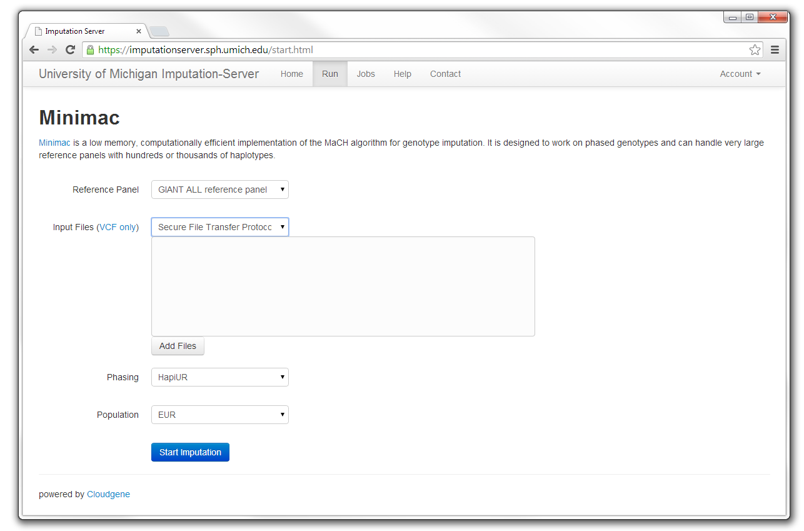
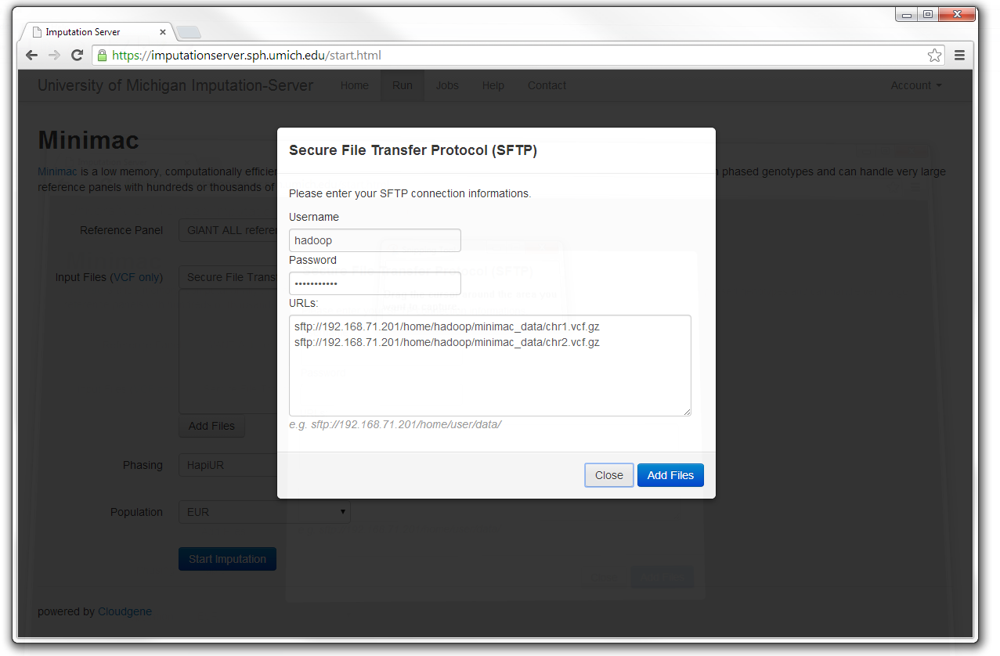

# Getting started

To use Michigan Imputation Server, a registration is required. After the email address has been verified (by an activation link), the service can be used without any costs.


## Upload your data

VCF files can be uploaded either from your local disk or by specifying a remote sftp location. In both cases, several files or several locations can be selected at once. All data (input and output) is deleted after the job has finished.


### File Upload

When using the file upload, data is imported from the local file system to Michigan Imputation Server. One (minimac_test.chr01.vcf.gz) or several files (minimac_test.chr01.vcf.gz - minimac_test.chr02.vcf.gz) can be imported at once.  

### sftp Upload

A convenient way to upload data is by specifying a remote SSH server location. This can be achieved by selecting "Secure File Transfer Protocol" and using the "add files" button. A URL consists of the server address followed by the full Unix path. Several paths can be specified in consecutive lines.

````sh
URLs: sftp://192.168.71.201/home/my_user/vcfDir/
````

In this example, the server address is "sftp://192.168.71.201" followed by the full path "/home/my_user/vcfDir/". No colon is included between server path and file path. The following three screenshots show the process in detail:   


## Start the Imputation!

After specifying the data location, the imputation process can be started immediately. The default values are:

*   Reference panel: 1000 Genomes Phase3
*   Phasing: [Eagle2](https://data.broadinstitute.org/alkesgroup/Eagle/). This can be toggled to [SHAPEIT](https://mathgen.stats.ox.ac.uk/genetics_software/shapeit) or [HAPI-UR](https://code.google.com/p/hapi-ur/).
*   Population for the allele frequency check: EUR

In the background several steps are executed:

*   **VCF check:** validity + statistics such as #samples, chromosomes, SNPs, chunks, phased / unphased, reference build.
*   **Quality control statistics:** duplicate sites, SNPs removed, NonSNP sites, monomorphic sites, MAF check.
*   **Imputation**: Imputation is achieved with minimac4\. An overview of running / waiting / completed steps per user can be displayed.


## Download results

The user is notified by email, as soon as the imputation job has finished. A zip archive including the results can be downloaded directly from the server. To decrypt the results, a one-time password is generated by the server and included in the email. The data is deleted automatically after 7 days. The QC report can be displayed and downloaded as well.


