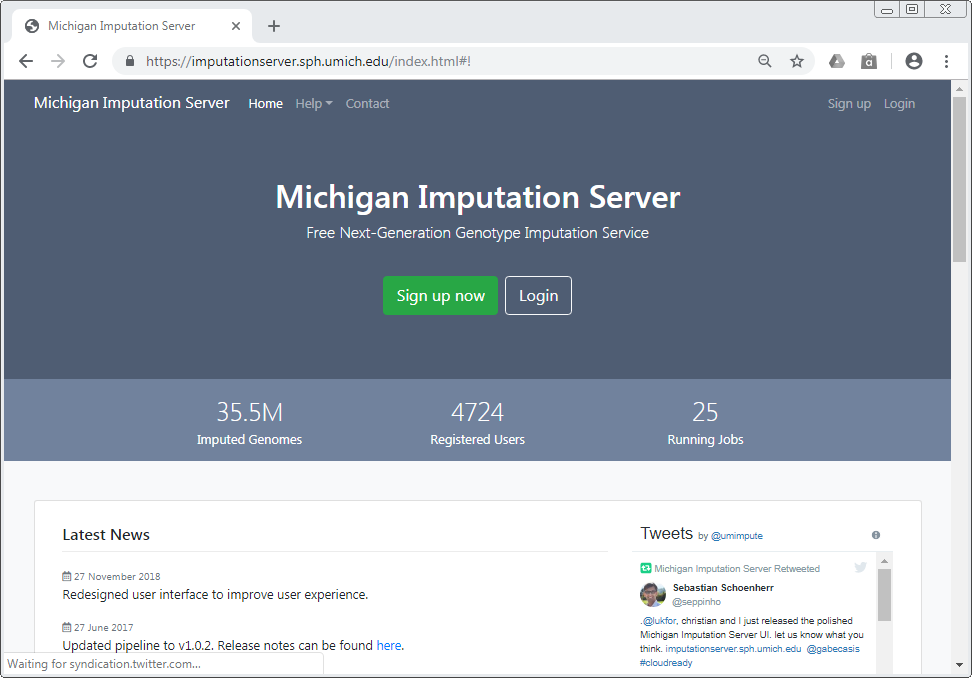

# Munich Imputation Server

[Munich Imputation Server](http://146.107.169.108:8082) provides a free genotype imputation service using [Minimac4](http://genome.sph.umich.edu/wiki/Minimac4). You can upload phased or unphased GWAS genotypes and receive phased and imputed genomes in return. Our server offers imputation from 1000 Genomes (Phase 1 and 3), CAAPA, [HRC](http://www.haplotype-reference-consortium.org/) and the [TOPMed](http://nhlbiwgs.org/) reference panel. For all uploaded datasets an extensive QC is performed.

Please cite this paper if you use Michigan Imputation Server in your publication:

> Das S, Forer L, Schönherr S, Sidore C, Locke AE, Kwong A, Vrieze S, Chew EY, Levy S, McGue M, Schlessinger D, Stambolian D, Loh PR, Iacono WG, Swaroop A, Scott LJ, Cucca F, Kronenberg F, Boehnke M, Abecasis GR, Fuchsberger C. [Next-generation genotype imputation service and methods](https://www.ncbi.nlm.nih.gov/pubmed/27571263). Nature Genetics 48, 1284–1287 (2016).

The complete source code is hosted on [GitHub](https://github.com/genepi/imputationserver/) using Travis CI for continuous integration.
