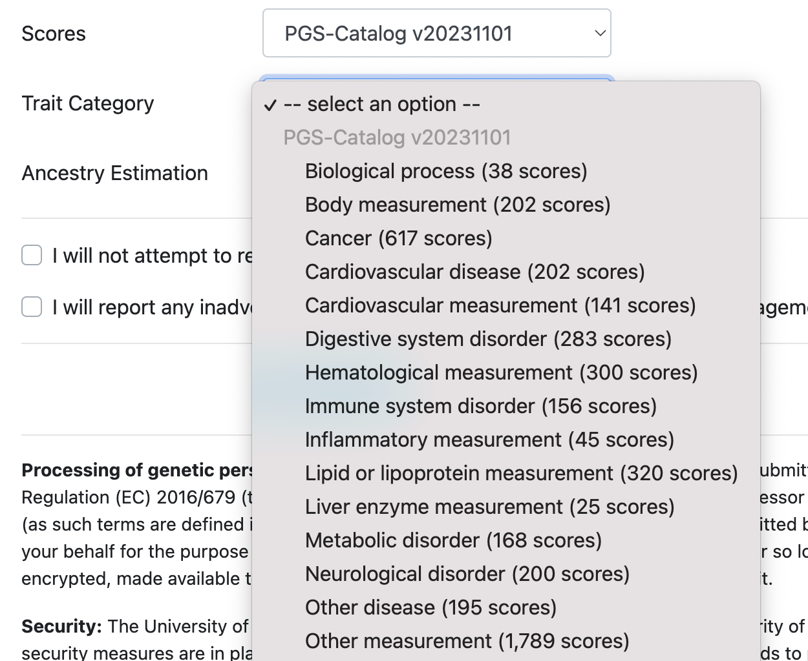
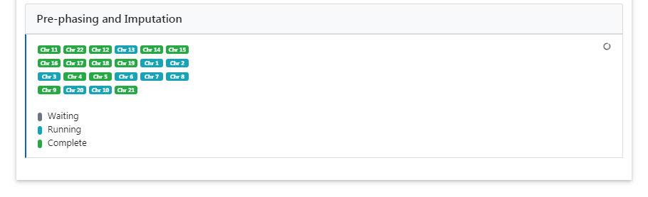

#  Polygenic Score Calculation

We provide an easy to use and user-friendly web interface to apply thousands of published polygenic risk scores to imputed genotypes in an efficient way.
By extending the popular Michigan Imputation Server the module integrates it seamless into the existing imputation workflow and enables users without knowledge in that field to take advantage of this method.
The graphical report includes all meta-data about the scores in a single place and helps users to understand and screen thousands of scores in an easy and intuitive way.

An extensive quality control pipeline is executed automatically to detect and fix possible strand-flips and to filter out missing SNPs to prevent systematic errors (e.g. lower scores for individuals with missing or wrong aligned genetic data).

## Getting started

To utilize the Polygenic Score Calculation extension on ImputationServer, you must first [register](https://imputationserver.sph.umich.edu/index.html#!pages/register) for an account.
An activation email will be sent to the provided address. Once your email address is verified, you can access the service at no cost.

**Please note that the extension can also be used with a username without an email. However, without an email, notifications are not sent, and access to genotyped data may be limited.**

No dataset at hand? No problem, download our example dataset to test the PGS extension: [50-samples.zip](https://imputationserver.sph.umich.edu/resources/50-samples.zip).

When incorporating the Polygenic Score Calculation extension in your research, please cite the following papers:

> Das S, Forer L, Schönherr S, Sidore C, Locke AE, Kwong A, Vrieze S, Chew EY, Levy S, McGue M, Schlessinger D, Stambolian D, Loh PR, Iacono WG, Swaroop A, Scott LJ, Cucca F, Kronenberg F, Boehnke M, Abecasis GR, Fuchsberger C. [Next-generation genotype imputation service and methods](https://www.ncbi.nlm.nih.gov/pubmed/27571263). Nature Genetics 48, 1284–1287 (2016).

> Samuel A. Lambert, Laurent Gil, Simon Jupp, Scott C. Ritchie, Yu Xu, Annalisa Buniello, Aoife McMahon, Gad Abraham, Michael Chapman, Helen Parkinson, John Danesh, Jacqueline A. L. MacArthur and Michael Inouye. The Polygenic Score Catalog as an open database for reproducibility and systematic evaluation. Nature Genetics. doi: 10.1038/s41588-021-00783-5 (2021).

## Setting up your first Polygenic Score Calculation job

1. [Log in](https://imputationserver.sph.umich.edu/index.html#!pages/login) with your credentials and navigate to the **Run** tab to initiate a new Polygenic Score Calculation job.
2. Please click on **"Polygenic Score Calculation"** and the submission dialog appears.
3. The submission dialog allows you to specify job properties.

The following options are available:

### Reference Panel

Our PGS extension offers genotype imputation from different reference panels. The most accurate and largest panel is **HRC (Version r1.1 2016)**. Please select one that fulfills your needs and supports the population of your input data:

- HRC (Version r1.1 2016)
- 1000 Genomes Phase 3 (Version 5)
- 1000 Genomes Phase 1 (Version 3)
- HapMap 2

More details about all available reference panels can be found [here](https://imputationserver.readthedocs.io/en/latest/pgs/reference-panels/). If you are unsure which reference panel to use, the "1000 Genomes Phase 3 (Version 5)" reference panel is multi-ancestry and has high coverage with available scores. However, if your uploaded data is European only, the HRC reference panel could be the better choice, as it enables the imputation of rare European-specific variants.

### Upload VCF files from your computer

When using the file upload, data is uploaded from your local file system to Michigan Imputation Server. By clicking on **Select Files** an open dialog appears where you can select your VCF files:

Multiple files can be selected using the `ctrl`, `cmd` or `shift` keys, depending on your operating system.
After you have confirmed your choice, all selected files are listed in the submission dialog:

Please make sure that all files fulfill the [requirements](/prepare-your-data).

!!! important
Since version 1.7.2 URL-based uploads (sftp and http) are no longer supported. Please use direct file uploads instead.

### rsq Filter
The filter ensures that only variants with an imputation quality (rsq) greater than the specified value are included in the polygenic risk score calculation. Setting the value to 0 disables the filter. Default value: 0.3.

### Build
Please select the build of your data. Currently the options **hg19** and **hg38** are supported. Michigan Imputation Server automatically updates the genome positions (liftOver) of your data. All reference panels are based on hg19 coordinates.

### Scores and Trait Category

Choose the precomputed Polygenic Score repository relevant to your study from the available options. Based on the selected repository, different trait categories appear and can be selected (e.g. Cancer scores):

   

More details about all available PGS repositories can be found [here](/pgs/scores/).

### Ancestry Estimation

You can enable ancestry estimation by selecting a reference population used to classify your uploaded samples. Currently, we support a worldwide panel based on HGDP.

## Start Polygenic Score Calculation

After agreeing to the *Terms of Service*, initiate the calculation by clicking on **Submit job**. The system will perform Input Validation and Quality Control immediately. If your data passes these steps, the job is added to the queue for processing.

   

## Monitoring and Retrieving Results

- **Input Validation**: Verify the validity of your uploaded files and review basic statistics.

  

- **Quality Control**: Examine the QC report and download statistics after the system filters variants based on various criteria.

  

- **Polygenic Score Calculation**: Monitor the progress of the imputation and polygenic scores calculation in real time for each chromosome.

  

## Downloading Results

Upon completion, you will be notified by email if you enter your address on registration. A zip archive containing results can be downloaded directly from the server.

  

Click on the filename to download results directly via a web-browser. For command line downloads, use the **share** symbol to obtain private links.

**Important**: All data is automatically deleted after 7 days. Download needed data within this timeframe. A reminder is sent 48 hours before data deletion.
