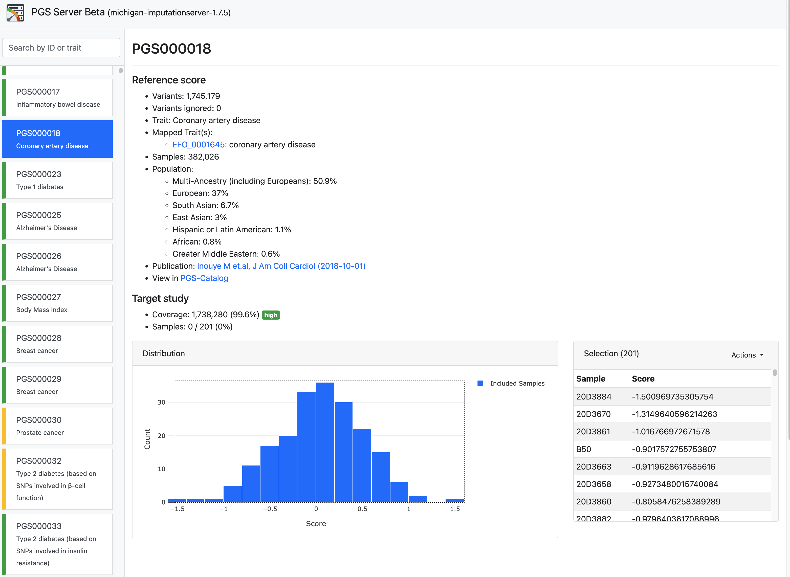
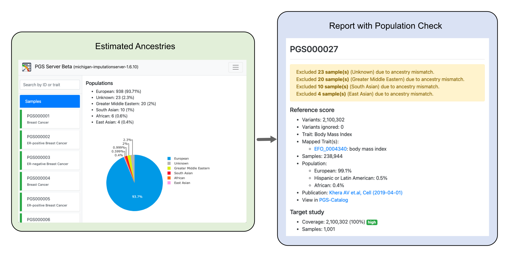

# Interactive Report

The created report contains a list of all scores, where each score has a different color based on its coverage. The color green indicates that the coverage is very high and nearly all SNPs from the score were also found in the imputed dataset. The color red indicates that very few SNPs were found and the coverage is therefore low.

In addition, the report includes detailed metadata for each score such as the number of variants, the number of well-imputed genotypes and the population used to construct the score. A direct link to PGS Catalog, Cancer PRSWeb or ExPRSWeb is also available for further investigation (e.g. for getting information about the method that was used to construct the score). Further, the report displays the distribution of the scores of all uploaded samples and can be interactively explored. This allows users to detect samples with either a high or low risk immediately.

Moreover, the report gives an overview of all estimated ancestries from the uploaded genotypes and compares them with the populations of the GWAS that was used to create the score.

If an uploaded sample with an unsupported population is detected, a warning message is provided and the sample is excluded from the summary statistics. 
